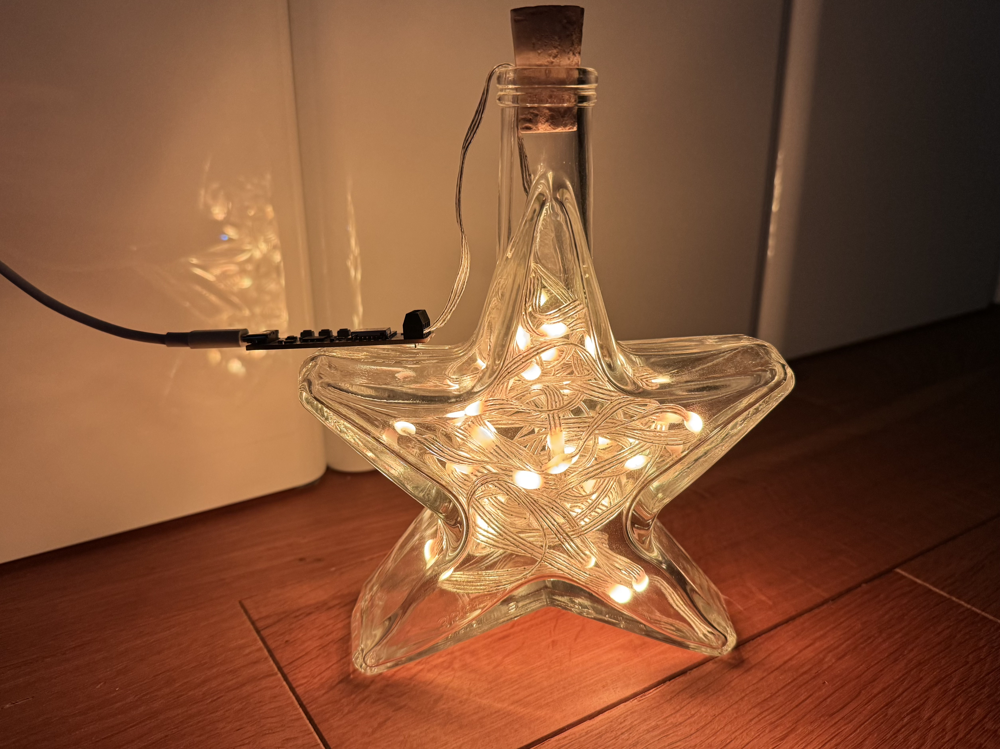
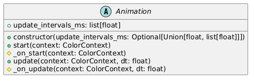
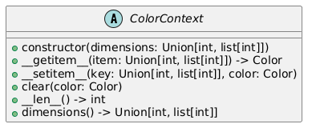
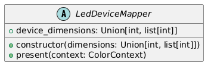
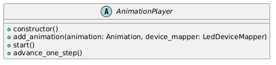
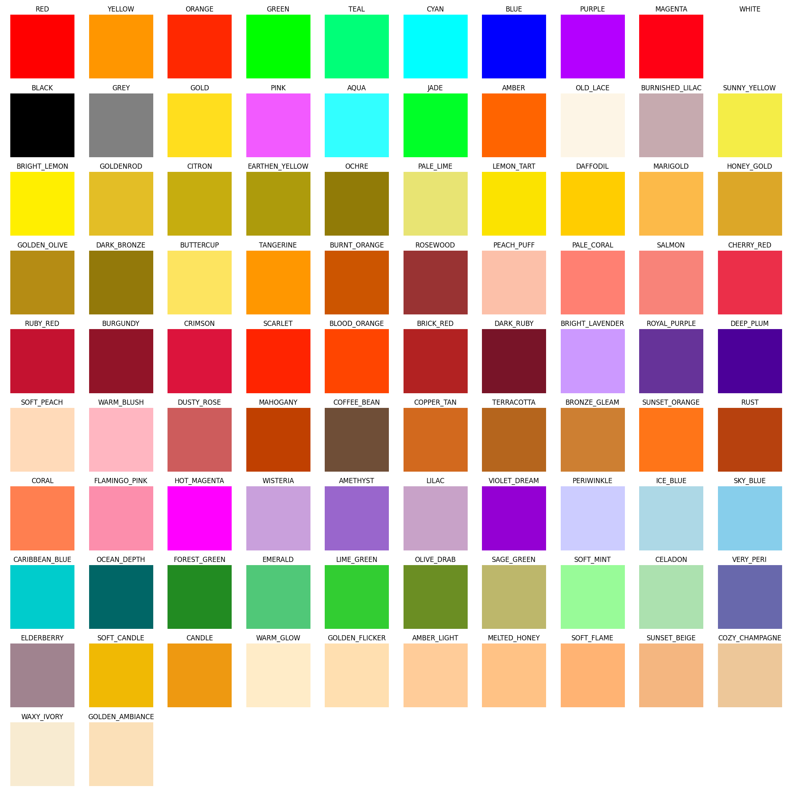
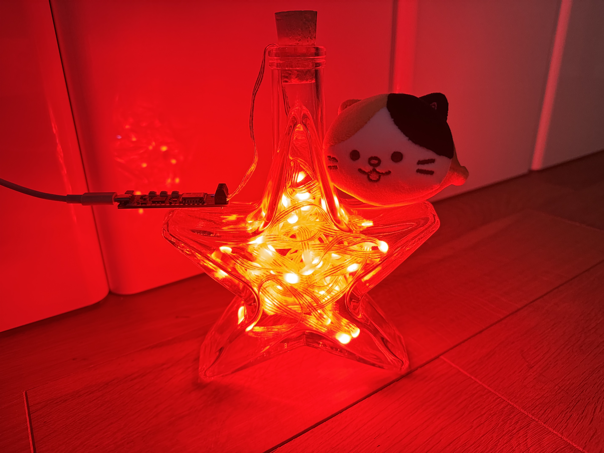
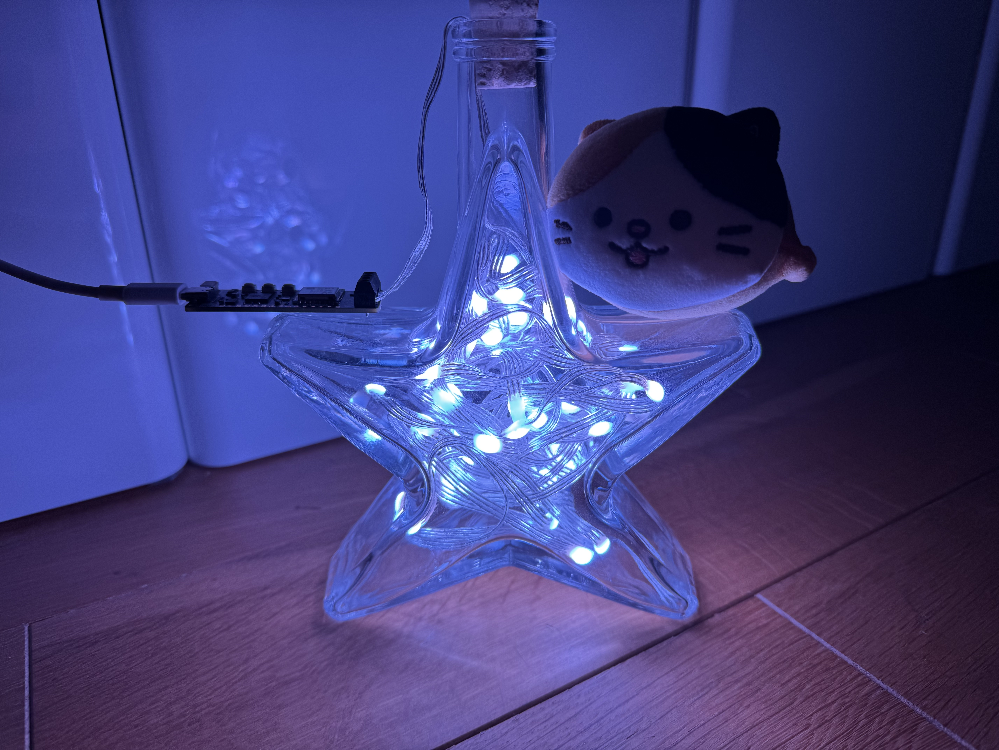

# MicroLed



**MicroLed** is a lightweight and efficient library designed for MicroPython, enabling smooth animations for LED grids, 
strips, rings, and more. Perfect for makers and developers, it offers easy-to-use APIs tailored for resource-constrained environments 🎄

## Installation

Microcontrollers don’t come with a package manager, so to use this library, you’ll need to fork it manually.
Here's an overview of the modules included:

- **animation:** This is the core module of the library — its heart and soul. It provides the basic abstractions you'll likely need,
though you might not require the entire module. For example, the **effects** submodule can be selectively included:
    - **effects:** Contains logic for specific animations. Since you probably won’t need all of them, you can save memory on your microcontroller by copying only
the effects you’ll use.
- **zoo:** A collection of predefined color palettes and effects (basically timing and color configurations).
While not essential, it’s a great source of inspiration for your projects.
- **example** and **tests**: These aren’t - technically - Python modules at all. 
They’re included for demonstration purposes, along with **main.py** and **ws2812_led_strip_mapper.py**.
- You can completely ignore **assets** folder as this is infrastructural files for this repository.

## Minimal working example

Below is a minimal working example.

```python
# Initialises hardware.
strip = plasma.WS2812(50, 0, 0, plasma2040.DAT, color_order=plasma.COLOR_ORDER_BGR)
strip.start()

# Controls the animation.
player = AnimationPlayer()

# Adds animation to play.
player.add_animation(
    animation=SolidColor(
        color=CANDLE,
    ),
    device_mapper=WS2818ColorStripMapper(
        strip=strip,
        mapped_indexes=[i for i in range(50)]
    ),
)

# It is necessary to initialise the player prior advancing the animation loop
# as it sets up the inner animations state, required to work properly.
player.start()

while True:
    # Advances animation cycle one step forward.
    player.advance_one_step()
```

## API

### Animation

The Animation class is the core component for defining the logic behind LED interactions.



This is essentially a template class for all animations in the codebase.
The Animation class functions as a state machine that updates periodically.
You can specify either a single update interval or multiple intervals (with the animation looping over the values)
using the `update_intervals_ms` parameter in the constructor.

Moreover, it offers a few useful methods that can be customized:
- **Optional `_on_start`:** Gives you a chance to initialize your animation.
- **`_on_update`:** Called each time the animation loop advances, after enough time specified in the `update_intervals_ms` have elapsed.

### Predefined animations

There are several predefined animations available in the `animation.effects` module:

- **`Blink`**: Alternates between the specified color and a disabled LED pixel.
- **`ColorCycle`**: Loops through the provided set of colors.
- **`Fade`**: Alternates between a disabled LED pixel and the specified color, gradually transitioning between the two states using simple linear interpolation.
- **`GradientCycle`**: Similar to `Fade`, but alternates between the provided colors.
- **`Progress`**: Fills the device pixel by pixel.
- **`Snake`**: Moves a snake of a given size along the LED device.
- **`SolidColor`**: Displays a single color for the entire duration.
- **`Sparkle`**: Creates a sparkling effect by randomly highlighting one of the device pixels and blending it with the background color.

### Color Context

The color context acts as your virtual memory for animations.
Essentially, it’s a multidimensional array that can represent LED devices of any complexity: a 1D strip, a 2D grid, a 3D cube, 
or even more unconventional configurations. It holds pixel values between `start` and `update` operations, 
reflecting the current state of your LED setup before being sent to the physical device for display.



The context can accept either a single integer or a list of dimensions, representing the addressing structure of your LED device.

Here’s a minimal example:  

```python
  color_context = ColorContext(dimensions=[5, 2])
  color_context[[0, 1]] = ColorContextTest.TEST_COLOR_A
```


Additionally, to ensure determinism when creating animations, `ColorContext` allows its data to be accessed as a contiguous 
in-memory chunk through the `__len__`, `__setitem__`, and `__getitem__` methods.  

> [!NOTE]
> Take a look at [`color_context_test.py`](./tests/color_context_test.py) for more usage examples.

### LED mapper

The device mapper serves as an abstraction layer between the animation and the physical device.
Think of it as a virtual device that can represent an entire LED setup or just a portion of it.



To correctly map your device, simply override the `present` method to display the state of the `ColorContext`.  

> [!NOTE]  
> That’s right—you can map just a portion of your device!  
> All you need is an index mapping between the virtual `ColorContext` indices and the real device indices.  
> Check out [`ws2812_led_strip_mapper.py`](./ws2812_led_strip_mapper.py) for an example of how to implement this mapping.  

### Animation Player


The Animation Player manages all parallel animations,
devices (or their portions — remember?), and their current states, represented by `ColorContext`.



Rather than implementing a `loop` that blocks the thread while the animation is running,
the `Player` provides the `advance_one_step` method. This approach offers greater flexibility,
allowing the animation to be used with various technologies such as simple loops, generators,
frameworks like `asyncio`, or multithreaded APIs.

## Zoo: collection of predefined colors and effects

### Colors

Below is a list of all the available predefined colors in the palette.



### Effects

A predefined effect consists of several components: the animation (i.e., the logic of the effect), colors, and timings.  

All predefined effects are designed for an entire LED matrix or strip. While they can be played on a portion
of the device (see [`LED device mapper`](./animation/led_device_mapper.py)),
this has not been tested for partial device use.

The list of effects is:

- POLICE_CAR_1
- POLICE_CAR_2
- EMERGENCY_CAR_1
- FIRE_CAR_1
- LIGHTNING
- RAINBOW
- TV
- CANDLE
- BROKEN_BULB
- PULSE
- SNOWFLAKES
- SPARKLES

## A few more photos of the project

| Red Solid Color                            | Blue Solid Color                              |
|--------------------------------------------|-----------------------------------------------|
|  |   |

> [!NOTE]
> See more examples at [`MicroLED` Youtube Playlist](https://www.youtube.com/playlist?list=PLucKuGqiOAE_1GyYPRy1i3J4XSmMSZjE9).


